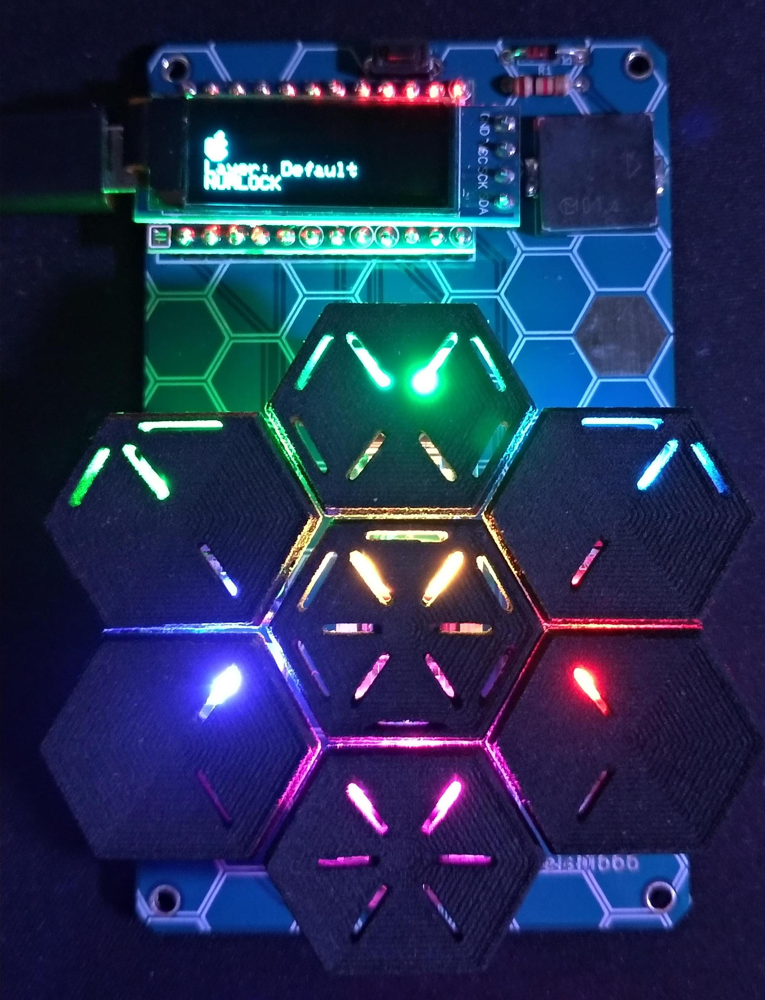
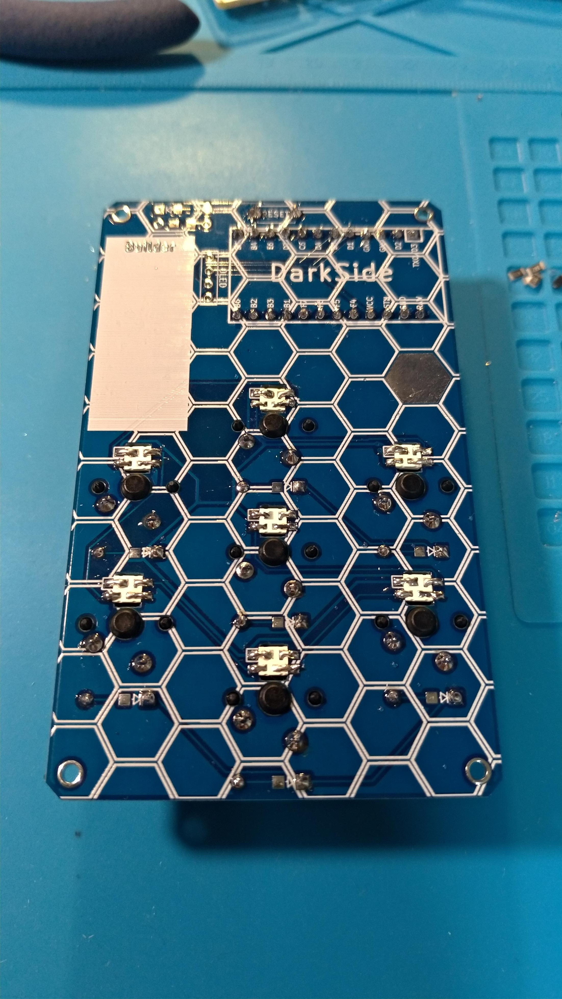
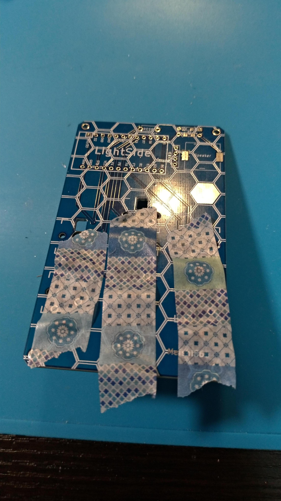

# meishi666(めいしとらいしっくす)ビルドガイド
## 材料


| 品目 | 数量 | 仕入先 |
| - | - | - |
| PCB | 1枚 | 魔王 |
| スルーホールダイオード(1N4148) | 7本(感圧スピーカ利用時8本) | 秋月電子 |
| ProMicro | 1個 | TalpKeyboard,遊舎工房 |
| タクトスイッチ | 1個 | 秋月電子、Aitendo |
| MX互換スイッチ(5pin推奨) | 7個 | TalpKeyboard,遊舎工房 |
| キーキャップ | 7個 | TalpKeyboard,遊舎工房 |
| LED(SK6812mini)(オプション) | 7個 | 遊舎工房,ピカリ館 |
| OLEDディスプレイ(オプション) | 1個 | 遊舎工房 |
| 感圧スピーカ(オプション) | 1個 | 秋月電子 |
| 1KΩ抵抗(スピーカ利用時) | 1個 | 秋月電子 |
私自身あまり順番とか気にせず気分で作ってるので、ちょっと写真の順番があべこべしてます。
気にしないでください。


## 1. LEDの実装(オプション、難易度高め)
1. 基板側の白い四角で囲んであるパッドに、LEDの一番大きいパッドを合わせるようにします。

2. 温度調整機能付きはんだごてで220℃くらいに設定します。(わりとすぐ壊れます)
3. パッド2個位ずつすばやくはんだジャンパーしていきます。(全部連続でやっていくと温度が上がって破損の危険が高まります)

## 2. ダイオードの実装

1. LightSideから黒いほうが左を向くように差し込みます。(ちょっときつい)

2. マスキングテープで動かないよう固定して、DarkSideに裏返します。

3. 足を0.5～1mmくらい残してニッパーで切ります。
4. はんだ付けします。


#### SwanTips
    * ダイオードの向きはキットによって上向き下向き左向き右向き斜めなどいろいろです。矢印向いてるほうに線を向けるように覚えてください。
    * ダイオードの向き全部間違えっちゃたーなんてときもどうか焦らず。ファームウェアでキースキャンの方向を変えればそのまま使えます。(Col2RowとかRow2Colとか宣言するだけ)
    * DarkSideから挿してもいいですが今回はトッププレート、ボトムプレートなしなので、表から挿したほうが空間に余裕があるのでおすすめしてます。

## 3. 感圧スピーカの実装(オプション)
1. 配線の都合でこれだけダイオードは右向きなので注意してください。スイッチのダイオードと同様でOKです。
2. 1KΩ抵抗を付けます。これは向きはないです。
3. 左側のパッドに予備ハンダを盛っておきます。

4. ピンセットで感圧スピーカ本体に軽く押さえつけなら、予備ハンダを溶かします。向きはないですたぶん。

5. 右のパッドにもはんだを流し込みます。

## 4. ProMicroの実装(ここだけめっちゃ慎重に!取り返しが付きません。不安なら聞いて!!)
1. LightSideからピンソケットをはめます。足が長いほうが下です。
2. ProMicroを上に重ねます。部品がたくさんくっついている方が下で、左(外側)にUSBの差込口が向くように。お願いします。。。

3. 浮いていないことを確認してはんだづけしていきます。先に両端のピンをはんだづけして、浮いていないことを確認して他をつけるのがよいです。

4. 裏返してProMicroを奥まで差し込んで、表面同様はんだづけします。

#### SwanTips
    * プロマイクロ自体の裏表、向き、基盤の裏につけるか表につけるかなどもキットによってまちまちです。
    しかも間違えて付けちゃうとリカバリがめちゃくちゃ大変です。
    ここだけはビルドガイドやフットプリントをよく見て確実に作業してください。
    とくにMCUをスイッチの裏につけるタイプ、Mint,ErgoDashなどはPromicroをつける前にスイッチ不良がないか確認してください。
    * USBの差込口は少しもげやすいです。実はUSBの仕様としてある程度もげやすくしないといけないのです。
    とはいえ高級なスイッチをはんだづけしたキーボードがUSB差込み口で無駄になるのはなんとも辛いので、エポキシ接着剤で事前に固めておくのがベターです。
    エポキシ接着剤は100円ショップに売っていて、一個変えば一生分のキーボードを作れる分はあるかと。
    * もげたPromicroを交換できるようにするコンスルーというピンヘッダがあって、ちょっとお高いけどとても便利です。
    * マグネットケーブルももげ対策には効果的です。

## 5. OLEDディスプレイの実装(オプション)
1. ピンソケットをはんだ付けします。マスキングテープかその他創意工夫を凝らして浮かないように気をつけてください。(←めんどくさくなってきた)
2. ピンソケットにピンヘッダを差し込みます。
3. OLEDディスプレイをはめて、余分な足をニッパーで切ってからはんだ付けします。

## 6. スイッチの実装
1. スイッチをはめます。ここはハマるようにしかはまらないので安心して。基板がぐらつくと思うのでスイッチをかませるとよいです。
片方のピンだけはんだ付けした段階で浮いてないか確認してください。浮いている場合LightSideからスイッチを指で上げながらはんだごてを当て直すとよいです。
2. もう片方のピンもはんだ付けします


#### SwanTips
    * 一般的なキーボードはスイッチを固定するトッププレートというものがありますが、今回は入門用ということでトッププレート無しです。
    トッププレートがないので、代わりにスイッチが回転しないように5pinのスイッチを使うのが良いです。
    * 一般的な5pinスイッチはPCBに刺さってはんだ付けしなくてもある程度固定されるようできているのですが、KailhPro5Pinはゆるゆるでした。はんだ付けしにくくてごめんなさい…！
    * 実は今回付けたスイッチの方向は一般的なCherry互換のスイッチと上下逆さまです。一般的なバックライト用の透過刻印のキーキャップが上部が光っていたほうがバエるので、バックライト対応のキーボードはこの向きが多いです。
    逆さまで問題になることはほとんどありませんが、CherryProfileというプロファイルのキーキャップだけ、若干スイッチと干渉するのでご注意あれ。

## 7. リセットスイッチの実装
1. リセットスイッチをLightSideからはめ込んで、DarkSideからはんだ付けします。(たぶんマスキングテープとかなくても問題ないかとー)

## 8. ファームウェアの書き込み
Windowsの方はMsys2という環境を入れてから臨むのがよいらしいです。

```sh
# 初回のみ
git clone https://github.com/swanmatch/qmk_firmware
cd qmk_firmware
sh util/qmk_install.sh
make git-submodule
# 初回のみ終わり
# Ubuntuなどの場合、頭にsudoを付ける必要があります。
make meishi666:default:avrdude
```

キーの割当を変更したい場合、下記をいじるとだいたい解決します。
https://github.com/swanmatch/qmk_firmware/blob/master/keyboards/meishi666/keymaps/default/keymap.c
